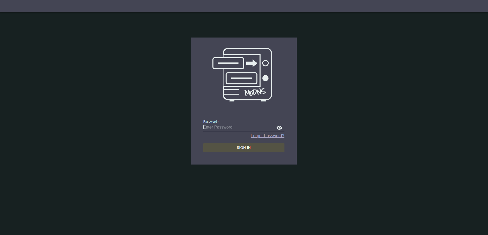
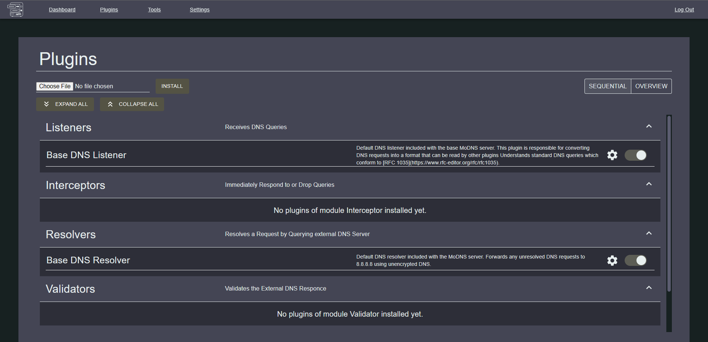
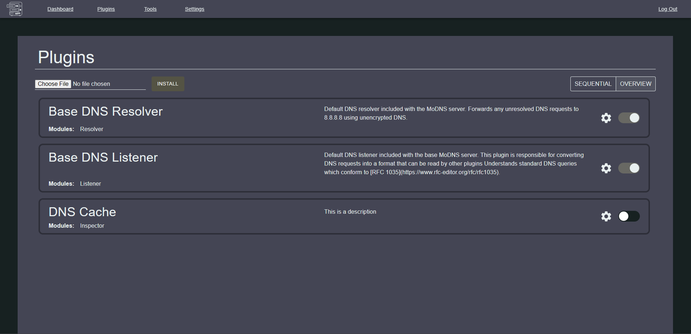

\pagebreak
# Appendix

Listed are additional links, images, and code referenced throuhout the report. 
 
## Appendix A

MoDNS Project Github Link:  
https://github.com/MoDNS/MoDNS
  
## Appendix B
  
RFC 1035:  
https://datatracker.ietf.org/doc/html/rfc1035

## Appendix C

Webpage Screenshots: 
 
### A.1

 

\pagebreak
### A.2

 
 
\pagebreak
### A.3

 

\pagebreak
### A.4


\pagebreak
### A.5


\pagebreak
### A.6


\pagebreak
## Appendix D

Plugin Example:  
  
```C++
#include "modns-sdk.hpp"
#include <sys/types.h>
#include <sys/stat.h>
#include <unistd.h>
#include <iostream>
#include <fstream>
#include <map>
#include <list>
#include <jsoncpp/json/value.h>
#include <jsoncpp/json/json.h>
#include <vector>
#include <iomanip>
#include <time.h>
#include <ctime>

bool is_empty(std::ifstream &pFile)
{
    return pFile.peek() == std::ifstream::traits_type::eof();
}

std::string getTime()
{

    time_t _tm = time(NULL);
    struct tm *curtime = localtime(&_tm);

    return asctime(curtime);
}

extern "C" uint8_t impl_inspect_resp(const modns_sdk::DnsMessage *req,
                                     const modns_sdk::DnsMessage *resp,
                                     uint8_t source,
                                     const void *plugin_state)
{

    std::list<Json::Value> dataList;
    Json::StreamWriterBuilder builder;
    Json::Value myData;

    // Open the input file stream to read JSON data from the file
    std::ifstream inputFile("../myData.json");

    if (inputFile)
    {
        inputFile >> myData;
    }
    inputFile.close();

    // Create a map to store the DNS message
    Json::Value myMap;

    modns_sdk::modns_log_cstr(3, "Line 3\n\n");

    myMap["timeStamp"] = getTime();
    myMap["id"] = req->id;
    myMap["is_response"] = req->is_response;
    myMap["truncation"] = req->truncation;
    myMap["response_code"] = req->response_code;

    // Go through the question vector
    uintptr_t num_questions = req->questions.size;
    for (uintptr_t i = 0; i < num_questions; i++)
    {
        myMap["questions_Type"] = req->questions.ptr[i].type_code;

        myMap["questions_Class"] = req->questions.ptr[i].class_code;
    }

    // go through the additional vector
    uintptr_t num_Additional = req->additional.size;
    for (uintptr_t i = 0; i < num_Additional; i++)
    {
        std::string ipv4 = "";
        for (int a = 0; a < 4; a++)
        {
            if (a == 3)
            {
                ipv4 = ipv4 + std::to_string(req->additional.ptr[i].rdata.a.address[a]);
            }
            else
            {
                ipv4 = ipv4 + std::to_string(req->additional.ptr[i].rdata.a.address[a]) + ".";
            }
        }
       
        myMap["additional IPv4 " + std::to_string(i)] = ipv4;
    }
    myData.append(myMap);

    // Streamwriterbuilder
    std::ofstream outfile("../myData.json");
    builder["indentation"] = "\t";
    std::unique_ptr<Json::StreamWriter> writer(builder.newStreamWriter());
    writer->write(myData, &outfile);
    std::string json_string = Json::writeString(builder, myData);

    // Print the JSON string to the console
    std::cout << json_string << std::endl;

    outfile << json_string << std::endl;

    return 0;
}
```


